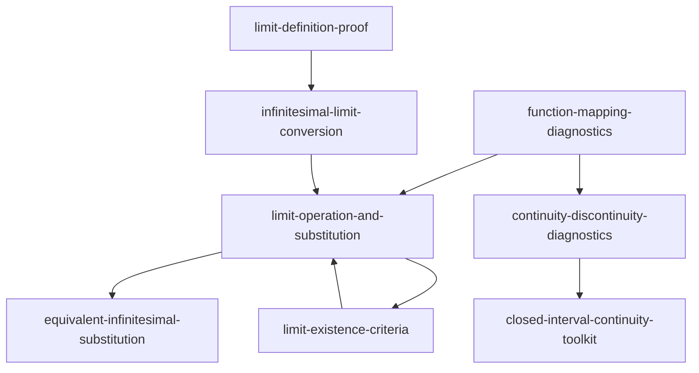

# 高等数学上册第一章 Skill Index

## 产物概览

本目录是按仓颉 RIA-TV++ 流程，从《高等数学》上册第一章“函数与极限”蒸馏出的第一版试点 skill 包。

源 PDF: `E:\project\高等数学教材上册【第七版】【高清OCR可检索版本】.pdf`

抽取范围: PDF 物理页 14-85，正文页 1-72。

## Skills

| skill | 何时调用 | 核心动作 |
|---|---|---|
| `function-mapping-diagnostics` | 函数定义域、反函数、复合函数、分段函数合法性 | 先检查定义域、对应法则、值域/单射/复合条件 |
| `limit-definition-proof` | 用定义证明极限或连续 | 反推并书写 epsilon-N / epsilon-delta 证明 |
| `infinitesimal-limit-conversion` | 用无穷小语言处理极限 | 把极限转为“常数 + 无穷小” |
| `limit-operation-and-substitution` | 第一章范围内普通极限计算 | 路由直接代入、化简、代换、重要极限 |
| `limit-existence-criteria` | 证明极限存在 | 使用夹逼准则或单调有界准则 |
| `equivalent-infinitesimal-substitution` | 无穷小比值极限 | 用等价无穷小替换并检查边界 |
| `continuity-discontinuity-diagnostics` | 连续性、间断点、补定义 | 检查函数值、左右极限、极限与点值 |
| `closed-interval-continuity-toolkit` | 闭区间连续函数存在性结论 | 使用最值、零点、介值、一致连续定理 |

## 调用图

## 推荐解题路由

1. 先看对象是否合法：定义域、分段、复合、反函数。
2. 若是极限题，先判断用户要“严格证明”还是“计算”。
3. 计算极限时优先检查连续代入；失败后再化简、换元、重要极限、等价无穷小。
4. 若目标不是求值而是证明存在，优先考虑夹逼或单调有界。
5. 若是连续性题，先做局部诊断；若题目出现闭区间连续函数，再调用闭区间工具箱。

## 审计文件

- `BOOK_OVERVIEW.md`: 阶段 0 整章理解。
- `MATH_ADAPTATION.md`: 仓颉流程的数学教材适配说明。
- `candidates/`: 阶段 1 候选池。
- `verified.md`: 阶段 1.5 三重验证记录。
- `rejected/`: 被拒绝或降级的候选。
- 每个 skill 目录下的 `test-prompts.json`: 阶段 4 压力测试用例。

